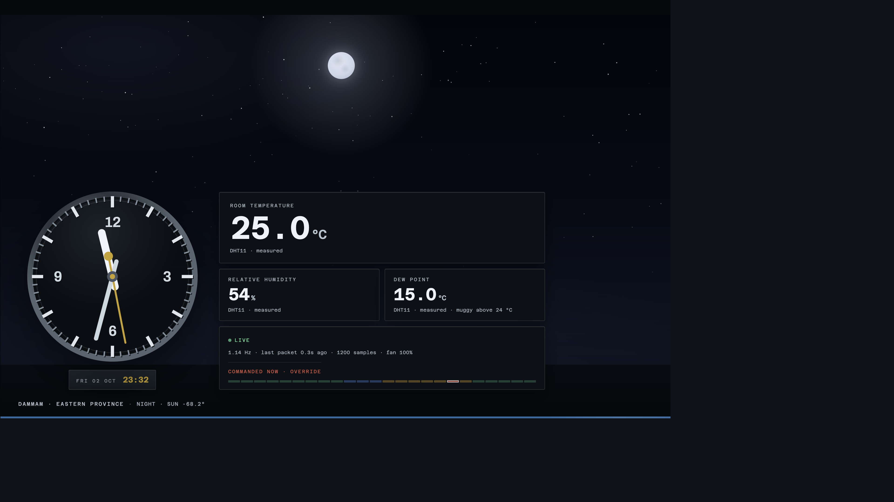
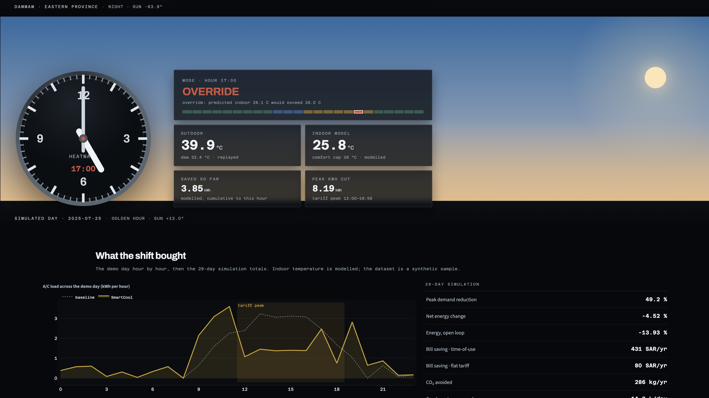

# SmartCool HEMS
**AUBH Team · Energy Track · Global Students Research Hackathon 2026**

A predictive A/C control system that pre-cools homes before electricity demand peaks, sizes the pre-cool and the peak cut so that the *modelled indoor temperature* stays comfortable, adapts to humidity via dew point, and estimates condensate water recovery.

> **Data honesty.** The sample dataset (`HEMS_Sample_Dataset.xlsx`) is **synthetic**: one building, 30 days of July 2025. Indoor temperature is **modelled** (first-order model with assumed time constant and thermal capacity). No public hourly indoor-temperature + A/C-kWh dataset for Eastern Province homes was found. The ML forecaster is a framework proven on a small synthetic set, not a generalisation claim. See `docs/EVIDENCE.md`.

## Results
<!-- KPIS:START -->
_Generated from `results/kpis.json` (data source: **synthetic_sample**; simulation, indoor temperature modelled). Do not edit by hand._

- **Peak reduction** (12:00-18:59 A/C load): **49.17%** (range 32.07 to 59.29% across house profiles and comfort limits)
- **Energy change, closed-loop**: **-4.52%** (negative = saving; open-loop would be -13.93%), range -20.8 to 3.75%
- **Comfort**: modelled indoor temperature stays at or below 26 C for **100.0%** of hours (max 25.679 C; baseline is 100% by construction)
- **Per home per year**: 431.38 SAR under projected TOU (0.18 / 0.30), 80.48 SAR under today's flat 0.18 tariff
- **CO2**: 286.2 kg per home per year; **condensate**: 14.29 L/day (formula unconfirmed)

Not shown: payback, Eastern Province totals. See `results/kpis.json` (payback and adoption-scaled ranges) and `results/claims.md`. Literature figures (E1-E10) live in `docs/EVIDENCE.md`, never in this block.
<!-- KPIS:END -->

Every number used in slides or video is listed with its source in `results/claims.md`. Ranges come from `results/sensitivity.csv` (house profile × comfort-rise limit × thermostat-recovery gain). The savings depend heavily on the assumed thermal parameters; the heat-wave scenario and sensitivity grid show how far.

## Architecture: one codebase, one source of truth
**Python plans, the device executes and protects, the dashboard observes.**

```
HEMS_Sample_Dataset.xlsx -> logic/load_data.py (provenance, phase fix) -> logic/forecast.py (day-ahead RF)
config.py (all constants) -> logic/planner.py (comfort-constrained grid) -> logic/engine.py plan_day() + step()
logic/indoor_model.py ------^                                                |
                                   results/kpis.json, sensitivity.csv, ablation.json, claims.md, demo_day.json
                                   data/processed/optimized_schedule.csv, firmware/replay_table.h, HARDWARE_CONTRACT.md
laptop bridge (bridge/serial_bridge.py)  H14,PEAK_REDUCE,75 ->  ESP32 + DHT11 + fan + 4 LEDs + LCD
```

`engine.run_batch()` is a loop over `engine.step()` (a test asserts identical output). The dashboard, firmware table and README numbers are generated from engine outputs; there are no replicas of the rules.

## Run
```bash
pip install -r requirements.txt
python train.py          # optional: retrain legacy models (pipeline.py never overwrites artefacts)
python pipeline.py       # writes results/, firmware/, docs/EVIDENCE.md, data/processed/, and the README block above
python -m pytest -q      # new tests
python tests/__init__.py # legacy 22 checks
streamlit run dashboard/app.py          # live Now panel (SIM until ESP32 DHT is connected)
python bridge/serial_bridge.py --dry-run   # print serial lines + write live_telemetry.json
```
The dashboard consumes `logic.engine.get_payload(date, hour, scenario)` and optional ESP32 telemetry from `data/processed/live_telemetry.json`. Do not quote numbers from the old report-style app.
## Honesty rules
- Energy savings are quoted **closed-loop** (thermostat recovery after the peak is paid for); open-loop is shown beside it.
- Under today's **flat** tariff the load shift itself saves nothing; savings are shown for both tariffs.
- Scenario days (e.g. heat wave) are labelled `SCENARIO` everywhere.
- The prototype's fan is an A/C stand-in; it demonstrates decision logic, not thermal physics. The box replays the schedule the model produced.
- Literature figures (E1-E10) are never presented as our results. Madinah lab data (E5) is not Eastern Province data.

## Hardware Prototype
ESP32 + DHT11 + LCD running the decision contract in `firmware/HARDWARE_CONTRACT.md` (generated from `config.py`). Fallback replay table: `firmware/replay_table.h` (generated).
[Open in Wokwi](https://wokwi.com/projects/460958709518064641) (sketch to be regenerated from the contract; it still shows the old wiring).

https://github.com/user-attachments/assets/2500ed41-5113-4c2d-bf1b-20d328dac2fd

## Dashboard

An instrument dial under a live sky, not a report:

```bash
python pipeline.py                 # once: demo day + firmware artefacts
streamlit run dashboard/app.py
```



Four sections, top to bottom:

| Section | Shows |
| --- | --- |
| **Now** | Wall-clock analog dial, the real sun over the site, and the live DHT11 room temperature, humidity and dew point |
| **The plan** | The simulated demo day stepping hour by hour, with the mode it chose and why |
| **What the shift bought** | The demo day's load curve against baseline, cumulative kWh saved, and the 29-day totals |
| **Sensors** | Feed health, streaming traces, session statistics, raw packets |

The sky is computed, not decorated. `dashboard/skyclock.py` solves solar declination and hour angle for `config.SITE_LAT / SITE_LON`, so sunrise lands at 05:10 and sunset at 18:40 on the demo date, the sun sits 82° up at noon, and every colour, the star field and the orb position follow that elevation. Watching the plan section is watching a day pass: dawn, bleached Gulf haze at noon, golden hour, then dark.



The laptop paces the simulated hour (3 s, 5 s in the tariff peak) and the ESP32 only senses and executes; it reads the DHT about once a second and streams every sample:

```bash
python bridge/serial_bridge.py --port /dev/cu.usbserial-0001   # start before board power
```

The bridge publishes each packet to `data/processed/live_telemetry.json` (+ `live_history.jsonl`) and the console fills in. With no board attached the measured tiles stay empty by design and read `waiting for the board`; "Replay the planned day" walks the schedule so the plan section still moves, and `python tools/fake_device_feed.py` emits stand-in DHT packets through the same path for console work (never used by the pipeline or the model).

https://github.com/user-attachments/assets/895f52ad-5ef7-4272-af1a-7fa0557637e7

## Own-data calibration kit
`tools/log_indoor.py` logs an indoor DHT11 (+ outdoor reading) every 5 min; `tools/fit_tau.py` fits the building time constant from A/C-off decays of at least 2 C. Write the physics override with `python tools/fit_tau.py data/own_log.csv --write-override`, then re-run `python pipeline.py`. Fitted tau replaces the assumed house profile for the indoor model only (dashboard/KPI label "own-measured"); the day-ahead RF still uses outdoor weather. Live DHT on the ESP32 is for local OVERRIDE / sensor_fail, not ML training.

## Team and module ownership
Inferred from the original module docstrings; confirm and edit.

| Member | Modules |
|---|---|
| Hana Wahban | data loading, features, forecaster, peak detection (`logic/load_data.py`, `features.py`, `forecast.py`, `model.py`, `peak_detection.py`, `train.py`) |
| Hamza Alkhaldi | control logic, indoor model, planner, engine, hardware bridge (`logic/indoor_model.py`, `planner.py`, `engine.py`, `bridge/`, `firmware/`) |
| Noor Al-Abdrabalnabi | KPIs, economics, scaling, claims (`evaluation/`, `logic/cost_savings.py`) |
| Zainab Alnassir | comfort thresholds, condensate, evidence and ethics (`logic/condensate.py`, `docs/`) |

American University of Bahrain (AUBH)
